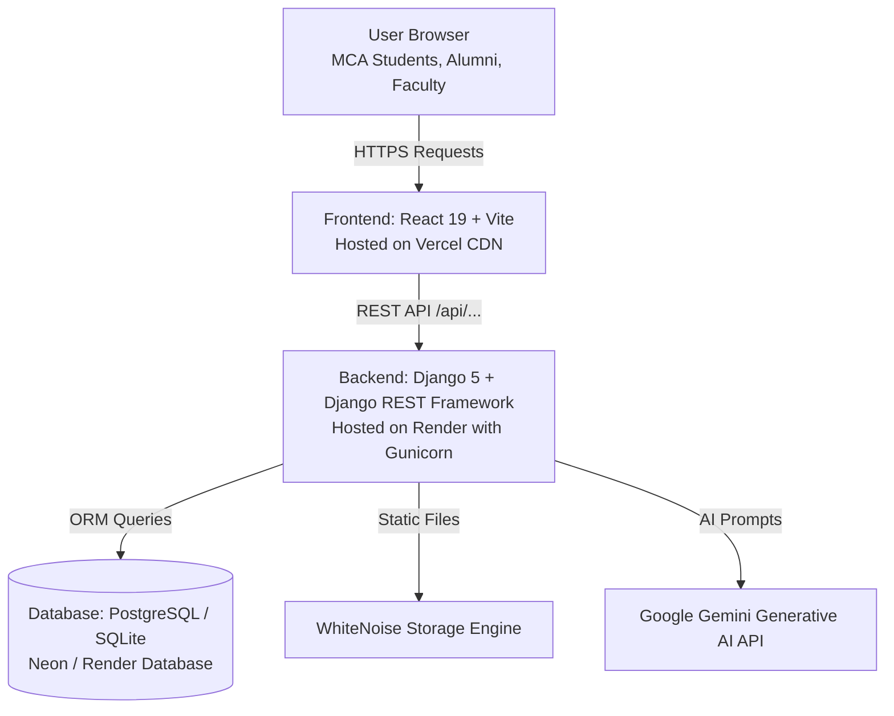
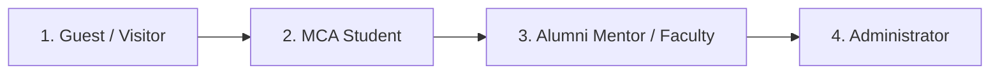

# 🎓 MCA Connect: Comprehensive Project Documentation & Technical Handbook

---

## 📌 1. Generalized Project Idea & Vision

### What is MCA Connect?
**MCA Connect** is an all-in-one, intelligent academic and career platform specifically designed for **MCA (Master of Computer Applications)** students, alumni, and faculty. 

In traditional college ecosystems:
- Junior students lack direct access to verified senior alumni working at top tech firms.
- Academic semester notes, past exam insights, and placement interview experiences are scattered across WhatsApp groups, Google Drives, or lost over time.
- Students build projects in isolation without a way to recruit peer teammates or get architectural feedback.

**MCA Connect bridges this gap** by creating a unified digital campus featuring:
1. **Peer-to-Peer Academic Forum (Q&A)** with code syntax highlighting and verified mentor badges.
2. **Curated Knowledge Hub & Roadmaps** for MCA curriculum notes, system design, and career roadmaps.
3. **Alumni Placement Intelligence** with real round-by-round interview debriefs and question banks.
4. **Student Project Showcase** with collaboration and teammate-recruiting filters.
5. **1-on-1 Alumni Mentorship Portal** with scheduling and Google Meet integration.
6. **AI Career Suite** powered by Google Gemini for resume gap analysis, code complexity explanation, and topic flashcards.
7. **Global Instant Search (`Ctrl+K`)** across all resources.

---

## 🏗️ 2. Technology Stack & Why We Chose It



| Layer | Technology | Why It Is Used | Plain English Explanation |
|---|---|---|---|
| **Frontend Framework** | **React 19 + TypeScript** | Enables dynamic, lightning-fast interactive interfaces without full page reloads. TypeScript prevents runtime bugs. | The visible interactive user interface that students click and type on. |
| **Frontend Tooling** | **Vite** | Extreme build speed, Hot Module Replacement (HMR), and lightweight bundle optimization. | The modern engine that compiles and runs the React frontend. |
| **Styling & UI** | **Tailwind CSS + Lucide Icons + Glassmorphism** | Modern, vibrant Aurora Prismatic design theme with soft gradients and responsive layout. | Makes the website look premium, modern, and beautiful on mobile and laptops. |
| **Backend Framework** | **Python 3.11+ & Django 5** | Robust security (CSRF protection, SQL injection prevention), built-in ORM, and rapid development. | The server brain that handles user accounts, business logic, and security. |
| **API Layer** | **Django REST Framework (DRF)** | Converts database models into JSON API endpoints (`/api/...`) consumed by React. | The bridge/translator allowing React to communicate with Django. |
| **Database** | **PostgreSQL (Production) / SQLite (Local)** | Relational database preserving student profiles, Q&A threads, project listings, and bookings. | The digital filing cabinet where all data is stored permanently. |
| **AI Intelligence** | **Google Gemini AI SDK** | Evaluates resumes against job descriptions and explains algorithmic time complexity. | The artificial intelligence brain powering the AI Assistant features. |
| **Production Server** | **Gunicorn + WhiteNoise** | High-concurrency WSGI web server and static asset caching. | Allows hundreds of students to browse simultaneously without crashing. |

---

## 👥 3. User Roles & Permission Hierarchy (RBAC)

MCA Connect enforces strict **Role-Based Access Control (RBAC)** across 4 user tiers:



1. **Guest (Unauthenticated)**:
   - Can explore all 5 hubs, read study guides, view roadmaps, read placement debriefs, use AI tools, and search globally.
   - Interactive write/booking actions trigger the sign-in modal.

2. **MCA Student (`STUDENT`)** (`ananya_roy` / `pass1234`):
   - Ask Q&A questions, answer peer questions, mark own questions as solved.
   - Showcase projects, toggle "Looking for Teammates", recruit peers.
   - Share placement experiences, upvote helpful debriefs.
   - Book 1-on-1 mentorship sessions with alumni.
   - Apply to become a peer mentor.
   - Delete/edit own resources.

3. **Alumni Mentor (`ALUMNI` / `FACULTY`)** (`rahul_verma` / `pass1234`):
   - All student permissions.
   - **Publish Official Study Guides & Roadmaps** (`POST /api/knowledge/articles/`).
   - Access the **Mentor Approval Panel** to accept/decline student 1-on-1 booking requests and attach Google Meet links.
   - Answers carry verified **Verified Mentor Solution** badges.
   - Can undo/delete mentor profile and revert account back to regular student anytime.

4. **Administrator (`ADMIN`)** (`admin` / `admin123`):
   - Full moderation: can edit, delete, or manage any question, answer, project, placement log, article, or mentorship session across the platform.

---

## 📦 4. Complete Codebase Map & File Explanations

### Backend Directory (`d:\MCA Connect\`)

```
d:\MCA Connect\
├── manage.py                       # Django CLI controller
├── requirements.txt                # Python package dependencies
├── Procfile                        # Cloud process definition (Gunicorn)
├── build.sh                        # Build automation script (Migrations + Static + Seed)
├── render.yaml                     # Infrastructure blueprint for Render
├── test_all_apis.py                # 16-point automated test suite
├── mca_connect/                    # Project Configuration Package
│   ├── settings.py                 # Core configuration (DB, CORS, Security, WhiteNoise)
│   ├── urls.py                     # Master URL routing
│   ├── api_urls.py                 # REST API URL router (/api/...)
│   ├── api_views.py                # REST API controllers & serializers
│   ├── authentication.py           # CSRF-exempt session authentication class
│   └── wsgi.py                     # Production WSGI application gateway
└── apps/                           # Modular Django Apps
    ├── accounts/                   # User model, authentication, reputation points
    ├── knowledge/                  # Study guides, categories, semester roadmaps
    ├── interviews/                 # Placement logs, company questions, CTC tracking
    ├── projects/                   # Student project gallery, tech stacks, recruitment
    ├── qa/                         # Q&A discussion forum, voting, solution verification
    ├── mentorship/                 # Mentor profiles, 1-on-1 session booking system
    ├── ai_assistant/               # Google Gemini AI integrations (Resume, Code, Flashcards)
    └── core/                       # Global stats context processor & seed commands
```

#### Key Backend Files Explained:
- **`mca_connect/settings.py`**: Central configuration. Switches between SQLite (local) and PostgreSQL (production via `DATABASE_URL`), enables WhiteNoise static caching, and configures CORS/CSRF for Vercel.
- **`mca_connect/api_views.py`**: The primary REST API engine handling all GET, POST, and DELETE endpoints with permission checks and serialization.
- **`apps/core/management/commands/seed_production_data.py`**: Automatically populates demo accounts (Student `ananya_roy`, Mentor `rahul_verma`, Admin `admin`), initial study guides, placement logs, and projects on first deploy.

---

### Frontend Directory (`d:\MCA Connect\frontend\`)

```
d:\MCA Connect\frontend\
├── index.html                      # HTML entry point (SEO tags, Google Fonts)
├── package.json                    # Node dependencies & npm scripts
├── vite.config.ts                  # Vite build configuration & local API proxy
├── vercel.json                     # Vercel SPA routing rules & production API proxy
└── src/
    ├── main.tsx                    # React application root mount
    ├── App.tsx                     # Main layout, tab navigation, auth session state
    ├── index.css                   # Tailwind CSS tokens, glassmorphism & gradients
    ├── components/                 # Hub Views
    │   ├── Navbar.tsx              # Top navigation, global search trigger, profile dropdown
    │   ├── HeroStats.tsx           # Live platform counter banner
    │   ├── KnowledgeHub.tsx        # Notes, guides & semester roadmaps view
    │   ├── InterviewHub.tsx        # Placement intelligence & round debriefs
    │   ├── ProjectsHub.tsx         # Project showcase & teammate recruitment
    │   ├── QAHub.tsx               # Academic forum with answer drawers
    │   ├── MentorshipHub.tsx       # Mentors directory & booking approval panel
    │   ├── AILab.tsx               # AI Code Explainer & Flashcards studio
    │   ├── ResumeMatcher.tsx       # AI Resume Gap Analyzer
    │   └── AuthModal.tsx           # Login / Register / Fast-access demo selector
    └── components/modals/          # Interactive Full-Screen Modals
        ├── GlobalSearchModal.tsx   # Ctrl+K instant search across all 5 databases
        ├── ArticleDetailModal.tsx  # Full Markdown reader for study guides
        ├── RoadmapDetailModal.tsx  # Step-by-step career milestone breakdown
        ├── ProjectDetailModal.tsx  # Deep architecture & open roles viewer
        ├── InterviewDetailModal.tsx# Round-by-round interview debrief viewer
        ├── BecomeMentorModal.tsx   # Peer mentor registration form
        ├── BookSessionModal.tsx    # 1-on-1 slot booking form
        ├── CreateProjectModal.tsx  # Showcase project submission form
        ├── CreateQuestionModal.tsx # Forum question composer
        ├── PublishArticleModal.tsx # Mentor study guide publisher
        └── ShareInterviewModal.tsx # Placement debrief submission form
```

---

## ⚙️ 5. What We Built & Solved Step-by-Step (The Journey)

1. **Modern Prismatic Frontend Overhaul**: Replaced default browser styles with a modern Aurora Prismatic design using React 19, Tailwind CSS, and Lucide icons.
2. **Fast-Access 1-Click Demo Accounts**: Created an intuitive demo role selector on the login modal allowing visitors to switch between Student (`ananya_roy`), Alumni Mentor (`rahul_verma`), and Admin (`admin`) with one click.
3. **Role-Based Feature Enforcement**: Restriced study guide publishing to Alumni/Faculty, enabled Mentor Approval Panels for managing meeting slots, and added verified mentor solution badges on Q&A.
4. **Mistake Rectification / Undo Capabilities**: Added the ability for users who accidentally created a mentor profile to revert back to a standard MCA Student with one click.
5. **Interactive Detail Modals Suite**: Created 8 dedicated modals for reading full Markdown articles, viewing step-by-step roadmaps, analyzing project architectures, and reviewing interview rounds.
6. **Live Instant Search (`Ctrl+K`)**: Built a unified multi-database full-text search engine in the backend and connected it to a floating modal.
7. **Automated 16-Point Test Suite**: Developed `test_all_apis.py` to rigorously validate all endpoints, authentication, CRUD operations, and proxy communication.
8. **Cloud Production Deployment**: Configured Gunicorn, WhiteNoise, PostgreSQL, `render.yaml`, `build.sh`, and `vercel.json` for live deployment on Render and Vercel.

---

## 🚀 6. Cloud Deployment Architecture

- **Backend (Render)**:
  - Repository connects to Render as a Python Web Service.
  - On every deployment, `build.sh` installs dependencies, runs database migrations, seeds initial data, and collects static files.
  - Gunicorn serves the Django application at `https://mca-connect.onrender.com`.
- **Frontend (Vercel)**:
  - Repository connects to Vercel pointing to the `frontend` root directory.
  - Vercel builds the React SPA into static bundles distributed across global Edge CDNs.
  - `vercel.json` rewrites `/api/*` calls to the live Render backend URL while serving `/index.html` for client-side routing.

---

## 🎓 7. Project Defense & Viva Cheat Sheet (Q&A)

### Q1: What is the architecture of MCA Connect?
> **Answer**: MCA Connect follows a decoupled **Client-Server Single Page Application (SPA)** architecture. The frontend is built using React 19 with Vite and Tailwind CSS, while the backend is a RESTful API powered by Django 5 and Django REST Framework. Data is persisted in a PostgreSQL relational database.

### Q2: How does authentication work across different domains (Vercel & Render)?
> **Answer**: Authentication uses Django session cookies with `CORS_ALLOW_CREDENTIALS = True`, `SESSION_COOKIE_SAMESITE = 'None'`, and `SESSION_COOKIE_SECURE = True`. In addition, `vercel.json` proxies `/api/` calls directly to Render, eliminating cross-origin cookie restrictions.

### Q3: How is Role-Based Access Control (RBAC) enforced?
> **Answer**: RBAC is enforced at the database model level (`User.role`) and checked inside Django view controllers. For example, publishing official curriculum guides checks for `role in ['ALUMNI', 'FACULTY', 'ADMIN']`, returning HTTP 403 Forbidden for unauthorized roles.

### Q4: How are AI features implemented?
> **Answer**: The AI assistant uses the Google Gemini Generative AI SDK (`google-genai`). Prompts are structured server-side in `apps/ai_assistant/services.py` to compare resume text with job requirements and output structured match percentages, missing skills, and step-by-step prep tasks.
